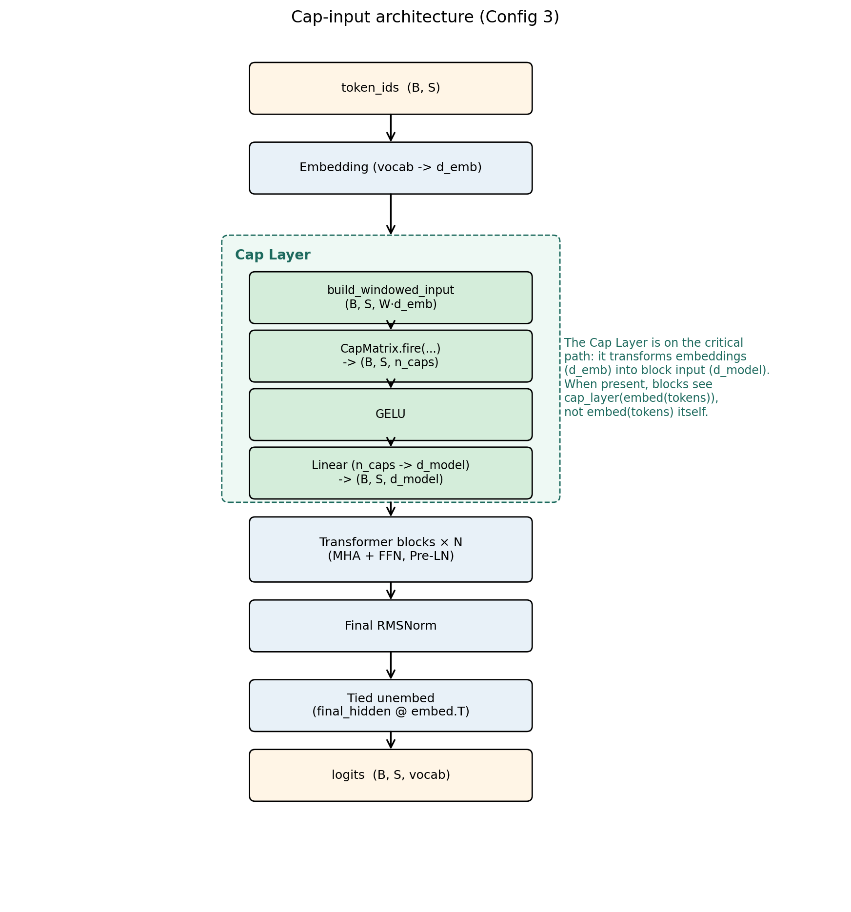
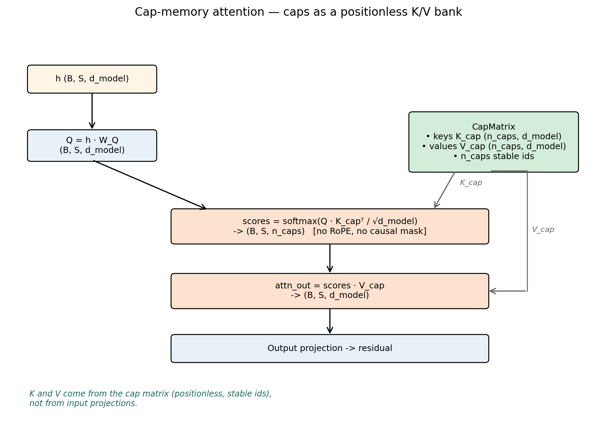
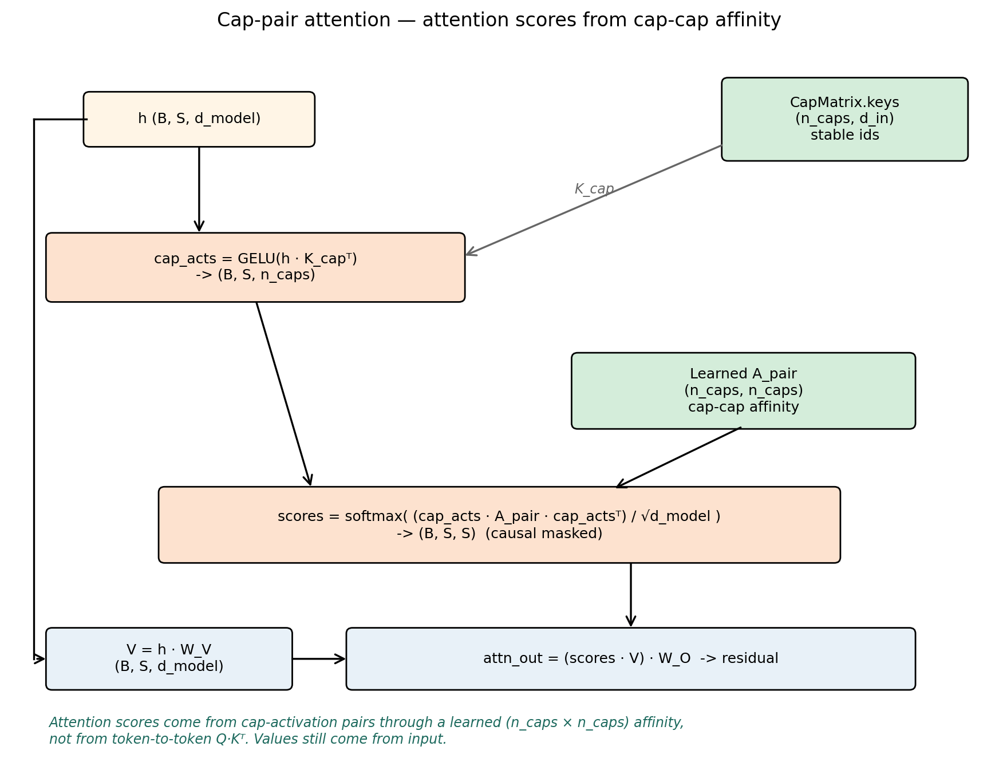
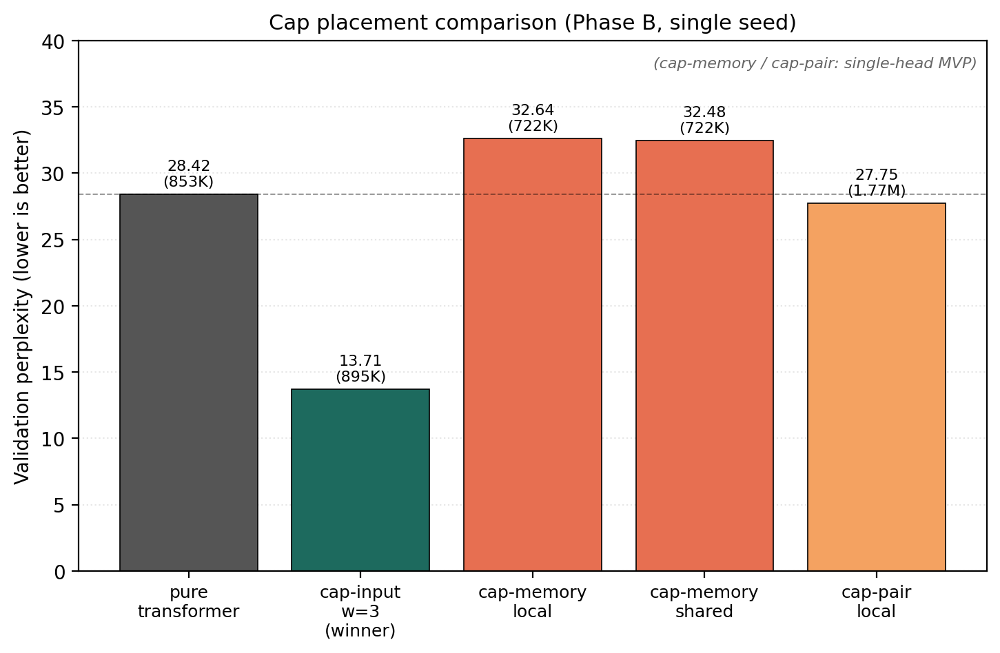
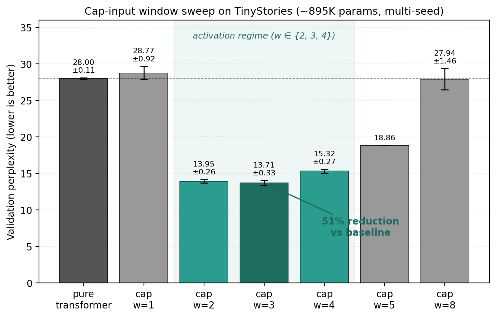

# Caps: Identifiable Computational Units for Transformer Augmentation

**Kürşat Kutlu Aydemir¹**

¹Independent Researcher · kursat.kutlu@gmail.com

*May 2026*

---

## Abstract

We introduce **caps** (short for *capability nodes*), identifiable
computational units with explicit discovery, audit, and growth
lifecycles, as a primitive for augmenting transformer-based language
models. Unlike anonymous FFN slots or fungible
attention heads, each cap carries a stable identifier across training
cycles, supports lifecycle operations (discovery, freezing, replacement,
growth), and exposes its learned content for inspection. We define the
cap primitive precisely, present a packed-matrix representation that
admits batched matmul while preserving per-cap addressability, and
demonstrate three architectural placements: "Cap as Input Projection",
"Cap as Attention Memory", and "Cap as Attention Routing".

On TinyStories (Eldan & Li 2023) at matched parameter count (~895K),
we evaluate the three architectural configurations (defined in Sections 1.1 and 4)
across four discovery strategies and multiple input window sizes, with
three-seed validation on the window sweep. The **Cap Input Projection with 3-token 
windows achieves validation perplexity 13.71 ± 0.33** (3 seeds),
a **51% perplexity reduction** relative to a same-scale pure-transformer
baseline (28.00 ± 0.11). The activation regime is broader than a single
point: window=2 lands at 13.95 ± 0.26 (3 seeds, statistically
indistinguishable from window=3), window=4 at 15.32 ± 0.27. Narrower
(window=1, 28.77 ± 0.92) and wider (window=8, 27.94 ± 1.46) windows both
collapse to baseline within noise. Caps add information in a specific
window-size *activation regime* (w ∈ {2, 3, 4}) and otherwise act as inert
pass-through. Cap-memory and cap-pair attention variants underperform the
pure-transformer baseline, a substantive negative result.

The cap primitive itself is a contribution independent of these
empirical results: it offers identifiability, lifecycle operations
(discovery, audit, growth), and per-unit addressability that
conventional FFN slots lack. These properties are motivated by
continual-learning concerns (preserving prior knowledge under new
training, replacing units that fall dormant, addressing concepts
across substrate drift), but empirical validation of those
capabilities is deferred to follow-up work. The present paper sketches
integration paths for continual-learning corpus cycles, concept
stability above the substrate, and concept-conditioned generation,
leaving their evaluation open.

---

## 1. Introduction

Modern language models built on transformer architectures (Vaswani et al.
2017) achieve state-of-the-art performance through scale + gradient
descent on dense parameter matrices. The internal representations remain
anonymous. This means, a particular row of an up-projection weight matrix (W_up) in a feed-forward network (FFN) block has no identity beyond its index, and its meaning depends entirely on the surrounding weights that may be retrained or replaced at any time.

This anonymity is a strength for raw scaling but a limitation for three
important capabilities:

1. **Continual learning**: when training on a new domain, gradient
   descent freely overwrites the parameters that encoded prior knowledge,
   producing catastrophic forgetting (McCloskey & Cohen 1989). Approaches
   that mitigate this (Elastic Weight Consolidation, Replay,
   Mixture-of-Experts) all add machinery that operates over dense
   parameter blocks without intrinsic identity.

2. **Interpretability**: probing FFN slots for "what they represent"
   (Geva et al. 2020) is feasible but requires post-hoc analysis;
   nothing in the slot's design supports stable referencing across
   training updates.

3. **Audit and replacement**: a specific slot cannot be selectively
   frozen, replaced with one tuned to a novel input region, or marked
   dormant, operations that would be natural for capsule-style
   architectures (Sabour et al. 2017) but absent from transformer FFNs.

This work introduces the **cap** (short for *capability node*), a
primitive computational unit designed to provide identifiability,
discovery, and lifecycle as first-class properties.

This paper is part of the **AWARE** research program, an exploration of
architectures where computational units carry stable identifiers,
support data-driven discovery, and admit lifecycle operations (audit,
freezing, growth). The cap primitive introduced here is the
foundational building block of AWARE. The present paper evaluates caps
in transformer-augmentation settings; future papers will examine
cap-native deep architectures, frozen-identity concept layers above
the substrate, and continual-learning protocols built on the same
primitive.

### 1.1 Contributions

1. **The cap primitive** (Section 3): a precise definition of caps as
   (id, key, value, metadata) tuples organized into a packed
   `CapMatrix` that admits both batched matmul and per-cap addressing.
   Cap lifecycle operations (discovery, audit, growth, freezing) are
   defined as first-class.

2. **Cap-based architectural placements** (Section 4): three concrete
   ways to integrate caps into transformer-shaped architectures,
   namely "Cap as Input Projection", "Cap as Attention Memory", and
   "Cap as Attention Routing", all built from the same `Cap` primitive.

3. **Empirical evaluation on TinyStories** (Sections 5-6): systematic
   benchmark of 27+ architecture variants spanning attention type,
   discovery strategy, input window size, and cap-matrix placement,
   with three-seed validation on the window sweep. At matched parameter
   count:
   - **Positive**: cap-input-with-window=3 + standard attention achieves
     **val perplexity 13.71 ± 0.33 vs pure transformer's 28.00 ± 0.11**
     (51% perplexity reduction, 3 seeds each).
   - **Window-activation regime**: cap layers help in a specific
     window-size regime (w ∈ {2, 3, 4} all beat baseline by >40%; w=1
     and w=8 both collapse to baseline within noise). Within the regime,
     w=2 (13.95 ± 0.26) and w=3 (13.71 ± 0.33) are statistically
     indistinguishable.
   - **Negative**: cap-memory and cap-pair attention variants underperform.
   - **Null**: at single-token cap input, no discovery strategy reliably
     beats baseline.

4. **Architectural lessons**: cap-input augmentation with multi-token
   windows behaves as a learned local-context primitive analogous to
   CNN preprocessing. The cap-attention variants tested here are
   minimal first-pass implementations (single-head, no multi-head structure,
   `NoDiscovery` init for the cap matrix); under these simplified conditions
   they underperform standard multi-head attention. Whether the
   cap-attention concept itself underperforms, or whether the
   negative result is an artifact of the simplified implementation, is left to
   a planned Phase B′ follow-up (see Section 6.2 caveat and Section 8 item 7) that
   tests fairer multi-head re-implementations with optional KMeans
   discovery on the K/V cap matrices. KMeans bootstrap on
   random-initialized embeddings produces lower-norm centroids than
   pure random unit vectors, slightly hurting performance.

---

## 2. Background and Related Work

### 2.1 Identifiable Computational Units

The desire for identifiable units in neural networks is not new.
Capsule Networks (Sabour et al. 2017; Hinton et al. 2018) introduce
"capsules" as vector-valued activations whose magnitude encodes
presence. Unlike caps, capsules are gradient-trained without explicit
lifecycle operations.

Mixture-of-Experts (Shazeer et al. 2017; Fedus et al. 2021; Jiang et al.
2024; Liu et al. 2024) gates parameters by expert index. Experts have
stable positions but are randomly initialized and gradient-trained;
they lack data-driven discovery and audit-based replacement. Recent
fine-grained MoE (Liu et al. 2024) reduces per-expert capacity and
increases expert count, moving in a direction sympathetic to caps'
many-small-identifiable-units design while retaining gradient-based
expert specialization.

Memory-augmented networks (Graves et al. 2014; Sukhbaatar et al. 2015;
Lample et al. 2019) attach external addressable memory. Memory slots
have positions but typically not semantic identity beyond what the
emitting controller assigns.

Concept Bottleneck Models (Koh et al. 2020) introduce intermediate
interpretable concepts but require concept labels at training time;
caps are unsupervised.

Sparse autoencoders (Cunningham et al. 2023) extract identifiable,
sparse-activation features from already-trained transformer activations
via dictionary learning. They share the goal of identifiability with
caps but achieve it as post-hoc decomposition rather than as an
architectural primitive trained jointly with the model. SAE features
acquire identity only after training; caps carry stable ids from
construction and admit lifecycle operations (replacement, freezing)
during training.

The cap primitive shares ancestry with each but distinguishes itself
by combining: (a) data-driven discovery, (b) per-unit u64 identity,
(c) explicit lifecycle (audit, replacement, growth), and (d) integration
into standard transformer architectures via well-defined placements.

### 2.2 Continual Learning

Catastrophic forgetting (McCloskey & Cohen 1989) remains an open
challenge. EWC (Kirkpatrick et al. 2017), Synaptic Intelligence (Zenke
et al. 2017), and GEM (Lopez-Paz & Ranzato 2017) regularize gradient
updates to protect prior knowledge. Replay-based methods (Rolnick et al.
2019) interleave examples from prior tasks. Structural approaches
(PackNet, Mallya & Lazebnik 2018; HAT, Serra et al. 2018) partition
the network. All operate over dense gradient-trained parameters
without intrinsic per-unit identity.

The cap primitive is designed to serve as the identifiable substrate
over which continual-learning operations (audit, freezing,
replay-by-concept) can be implemented cleanly. Empirical validation
of these capabilities, including multi-corpus experiments on
cap-augmented and cap-native architectures, is deferred to follow-up
work. We sketch the direction in Section 7.

### 2.3 Sparse-Coded Substrates and Hopfield Memory

Sparse-coded Hopfield substrates (Laiho et al. 2015; Tsodyks & Feigel'man
1988) combined with vector-symbolic role-binding (Plate 1995; Kanerva
1988) provide an alternative continual-learning substrate. Prior project
work explored this line and identified specific failure modes when
attention is grafted onto bigram-keyed sparse storage. We do not
re-evaluate that architecture here; the cap primitive introduced in
this work is independent and applies to dense gradient-trained
architectures.

### 2.4 Transformer Architectures

Self-attention (Vaswani et al. 2017) provides cross-position information
flow via softmax(QK^T/√d_k)V. The FFN block in each transformer layer
provides per-position computation. The cap primitive can be placed in
either position: as a feature extractor at the input (replacing or
augmenting the embedding projection), or inside attention (as a
KV-memory bank that positions attend to). We evaluate both.

Recent transformer-LM advances target multiple axes: expert
architecture (Jiang et al. 2024; Liu et al. 2024), training-data
curation (Abdin et al. 2024), and post-training reinforcement for
reasoning (DeepSeek-AI 2025). Cap-based substrate changes are
orthogonal to all three and could in principle combine with any of
them.

---

## 3. The Cap Primitive

### 3.1 Definition

A **cap** is a tuple:

```
cap = (id, key, value, metadata)
```

where:
- `id: u64`, globally unique stable identifier persisting across
  training cycles and audit operations
- `key: Tensor[d_in]`, d_in-dimensional learnable direction the cap
  fires on
- `value: Option<Tensor[d_out]>`, d_out-dimensional learnable
  contribution when the cap fires (present for caps with output
  semantics; absent for pure pattern detectors)
- `metadata: CapMeta`, bookkeeping for lifecycle operations
  (activation_ema, age, frozen, dormant flags)

The cap's **firing** at input `x ∈ ℝ^{d_in}` is:

```
fire(cap, x) = activation(cap.key · x)
```

The output contribution (if `value` present) is:

```
output_contribution(cap, x) = fire(cap, x) · cap.value
```

### 3.2 Cap Matrix

Caps in a layer are organized into a `CapMatrix`:

```
CapMatrix {
    keys:     Tensor [n_caps, d_in]          // each row is one cap's key
    values:   Option<Tensor [n_caps, d_out]> // each row is one cap's value
    ids:      Vec<u64> [n_caps]              // stable identifiers
    metadata: Vec<CapMeta> [n_caps]          // per-cap bookkeeping
    kind:     CapKind                        // discovered/gradient/frozen/hybrid
    trainable: bool                          // whether keys/values receive
                                             // gradient updates
}
```

The packed matrix admits batched matmul for all caps' firings in one
shot:

```
firings = input @ keys.T    // shape: [..., n_caps]
output  = firings @ values  // shape: [..., d_out]
```

while individual caps remain addressable by index for lifecycle
operations.

### 3.3 Cap Kinds

We define four cap kinds that differ in how their content arises and
is updated:

| Kind | Bootstrap | Gradient updates | Audit lifecycle |
|------|-----------|------------------|------------------|
| **Discovered** | KMeans on data | None (frozen after bootstrap) | Yes |
| **Gradient** | Xavier random init | All keys + values | None |
| **FrozenRandom** | Random unit vectors | None | None |
| **Hybrid** | KMeans on data | All keys + values | Yes |

`Discovered` corresponds to classical AWARE caps: data-driven prototypes
that resist gradient drift. `Gradient` is structurally a transformer
FFN slot with an attached identifier. `FrozenRandom` provides
reservoir-computing identity. `Hybrid` combines KMeans bootstrap with
gradient refinement, audited periodically.

### 3.4 Discovery Strategies

The cap's content is filled by a `Discovery` strategy that takes a
sample of input vectors (or random initialization) and produces an
initial cap matrix:

| Strategy | Bootstrap input | Output |
|----------|-----------------|--------|
| **KMeans** | Sample of d_in vectors (e.g., 2000 embedded tokens) | n_caps centroids via k-means clustering |
| **Random** | None | n_caps random unit vectors |
| **NoDiscovery** | None | n_caps Xavier-random vectors (sets up gradient training) |
| **Hybrid** | Sample of d_in vectors | KMeans centroids; gradient + audit thereafter |

The strategy is selected at cap-layer construction; the same cap
primitive supports all four through the abstraction.

### 3.5 Lifecycle Operations

The cap primitive supports four lifecycle operations:

1. **Discover**: at construction (or re-bootstrap), populate the cap
   matrix from a bootstrap sample. Sets initial cap identities.

2. **Audit**: periodic operation that:
   - Identifies "dead" caps (low activation EMA over recent training)
   - Identifies "novel inputs" (input regions poorly covered by
     existing caps)
   - Pairs the deadest caps with the most novel inputs
   - Replaces dead cap rows with new caps initialized from novel input
     directions
   - The replaced cap receives a new u64 id; the slot position is
     preserved; downstream `W_proj` row is reset to allow gradient to
     relearn

3. **Freeze**: marks a cap as immune to audit replacement. Useful for
   protecting cap identities that have acquired specific semantic
   meaning.

4. **Grow**: increases n_caps by appending new rows. The downstream
   W_proj is extended with new columns initialized randomly; gradient
   learns to use the new caps over subsequent training.

These operations are orthogonal: any cap kind can support any subset
based on the `trainable` and `frozen` flags.

---

## 4. Cap-Based Architectures

The cap primitive is not specific to transformer architectures and
admits placement in any computational graph where identifiable units
can route computation. This paper evaluates three structurally distinct
placements within a transformer-shaped network, chosen because the
transformer is the dominant modern language-model architecture and
provides a strong baseline against which to measure caps' effect.
Other architectures (state-space models, RNNs, convolutional language
models, mixtures thereof) admit similar cap placements; their
evaluation is left to follow-up work. A related direction is the
cap-native deep architecture, where every transformer-style component
(attention QKV/O projections, FFN/MoE experts, normalization gains,
output projection) is replaced by per-cap parameter stacks gated by
cap activations; this direction is introduced in Section 1 as a future paper
and is not evaluated empirically here.

The three placements we evaluate are introduced below. For
cross-reference with the experimental tables in Section 6, we also number
each cap-matrix configuration:

- **Config 1**: a single global cap matrix shared across all attention
  layers (used in some CapMemory variants).
- **Config 2**: a per-block cap matrix at each attention layer (used
  in CapMemory and CapPair variants).
- **Config 3**: a cap input layer that fires on token embeddings
  before the attention stack (Section 4.1).
- **Config 4a / 4b**: combinations of Config 3 with Config 2 or
  Config 1, respectively (cap input plus attention caps; see Section 4.4).

These configuration numbers correspond to the entries in the Phase A-D
experimental tables in Section 6.

### 4.1 Cap as Input Projection (Config 3)

```
Tokens [B, T]
  -> Embedding lookup -> [B, T, d_emb]
  -> Cap layer: caps fire on each position's embedding (optionally
    windowed): [B, T, n_caps]
  -> W_proj: [n_caps, d_model] -> [B, T, d_model]
  -> Standard transformer blocks (attention + FFN) × N
  -> Output projection -> logits [B, T, vocab]
```



*Figure 1: Cap-input architecture (Config 3, the headline mechanism).
Token embeddings flow through the cap layer, which builds a windowed
view, fires the cap matrix, applies GELU, and projects to d_model via
a learned linear layer. The cap layer is on the critical path: the
transformer blocks receive cap_layer(embed(tokens)), not embed(tokens)
itself. When no cap layer is present (pure-transformer baseline),
embeddings pass directly to the blocks.*

Caps replace the conventional linear input projection with a discovered
feature extractor. When the input window > 1, each cap reads a
concatenated window of recent embeddings, becoming a local n-gram
pattern detector.

### 4.2 Cap as Attention Memory Bank (Configs 1, 2)

```
Tokens -> Embedding -> [B, T, d_model] (residual stream)
  -> For each block:
    -> Q = residual @ W_Q                           // [B, T, d_k]
    -> K = cap_matrix.keys                          // [n_caps, d_k]
    -> V = cap_matrix.values                        // [n_caps, d_v]
    -> scores = Q @ K.T / sqrt(d_k)                 // [B, T, n_caps]
    -> attn = softmax(scores)
    -> output = attn @ V                            // [B, T, d_v]
    -> FFN(output)
  -> Output projection -> logits
```



*Figure 2: Cap-memory attention. The cap matrix supplies both keys
(K_cap) and values (V_cap) for scaled-dot-product attention; Q comes
from the input projection as usual. Attention is (B, S, n_caps)-shaped
rather than (B, S, S): every position attends over the same positionless
cap bank rather than over other token positions.*

Caps replace the W_K and W_V projections of standard attention.
Positions attend to caps (T × n_caps attention pattern) rather than
to other positions. The cap matrix can be **per-block** (Config 2,
each block owns its caps) or **shared** (Config 1, one global cap
matrix referenced by all blocks). Sharing reduces parameter count and
gives caps cross-layer identity.

### 4.3 Cap as Attention Routing (Configs 1, 2)

```
Tokens -> Embedding -> [B, T, d_model] -> residual stream
  -> For each block:
    -> cap_acts = caps.fire(residual)                   // [B, T, n_caps]
    -> A_pair: learnable [n_caps, n_caps]
    -> attn[i,j] = cap_acts[i] @ A_pair @ cap_acts[j].T // [B, T, T]
    -> V = residual @ W_V                               // standard
    -> output = softmax(attn) @ V
    -> FFN(output)
```



*Figure 3: Cap-pair attention. Each position fires its caps to produce
cap activations; the (n_caps × n_caps) learned affinity matrix A_pair
mediates between source and target cap activations to produce
token-to-token attention scores. The scoring path does not use Q·K^T;
values still come from the input via standard W_V.*

Caps fire on the residual stream and their co-firing pattern (mediated
by a learnable cap-pair affinity matrix `A_pair`) determines attention
scores. This is a capsule-routing-style mechanism (Sabour et al. 2017)
where caps drive cross-position information flow.

Like the attention-memory placement (Section 4.2), the cap matrix used to
fire `cap_acts` can be either per-block (Config 2) or shared across
attention layers (Config 1). In the experiments reported in Section 6.2 we
evaluate this placement only with Config 2 (per-block cap matrix);
Config 1 (shared) is constructable through the same builder API but
not empirically evaluated in this paper.

### 4.4 Combined Placements

A cap input layer (Config 3) can be combined with an attention-bank
cap matrix (Config 1 or Config 2), giving two combination configs:

- **Config 4a** = Config 3 + Config 2: cap input layer plus a
  per-block cap matrix used by attention.
- **Config 4b** = Config 3 + Config 1: cap input layer plus a single
  global cap matrix shared across attention layers.

Both variants are constructible via the same cap primitive and a
fluent builder API. The Phase B experiments in Section 6.2 evaluate both
combination configs against the pure-transformer baseline and the
non-combined Configs 1, 2 individually.

---

## 5. Experimental Setup

### 5.1 Corpus

We use **TinyStories** (Eldan & Li 2023), a synthetic corpus of short
children's stories using vocabulary appropriate for 3-4-year-olds. We
pull 10K stories from the public release, producing approximately
2.07M training tokens and 105K validation tokens after BPE encoding
(256 merges, vocabulary 512). Train and validation are stories drawn
from disjoint subsets of the underlying generation, providing a clean
held-out evaluation distribution. The synthetic small-LM-training
paradigm initiated by TinyStories has since matured into production
small models (Abdin et al. 2024); we use the original TinyStories
release to isolate substrate-level changes from corpus engineering.

### 5.2 Architecture Configurations

All configurations share:

- d_model = 128
- n_heads = 4
- d_ff = 512 (in standard FFN blocks)
- n_layers = 4 (transformer blocks)
- max_seq_len = 128
- Tied embedding + output projection
- RoPE positional encoding inside attention
- RMSNorm with Pre-LN residual structure
- ~853K - 1.81M parameters depending on configuration

We sweep:

- **Attention type**: standard self-attention, cap-memory attention,
  cap-pair attention
- **Cap layer presence**: include cap input layer (Configs 3, 4) or
  not
- **Cap matrix source**: local per-block (Config 2) or shared global
  (Config 1)
- **Discovery strategy**: KMeans, Random, NoDiscovery, Hybrid
- **Input window size**: 1, 4, 8

### 5.3 Training Protocol

- Optimizer: AdamW (Loshchilov & Hutter 2017), lr = 3e-4
- Batch size: 32
- Sequence length: 128 tokens
- Training steps: 5000 (≈ 5.79 effective epochs over the train corpus)
- Eval every 100 steps on held-out validation tokens
- Loss: cross-entropy on next-token prediction

For each configuration we report final validation perplexity. For
selected configurations we run 3 seeds and report mean ± std.

### 5.4 Code, Reproducibility

The complete implementation is available in the AWARE codebase
(URL: `https://github.com/shyble/aware`).

**Implementation language**: AWARE is implemented in **Rust**, using the
candle tensor library (Hugging Face 2023) for forward/backward
computation on CPU and GPU (CUDA, Apple Metal). This
choice diverges from the prevailing Python/PyTorch convention in ML
research. The motivation is straightforward: Rust's ownership model
enforces tensor lifetime correctness at compile time, eliminating an
entire class of runtime memory and aliasing bugs; the type system makes
shape-mismatch errors compile-time failures rather than late-loop
crashes; and the resulting release binaries train without runtime
interpreter overhead. Candle's API is sufficiently expressive for the
cap-keyed routing patterns described in this paper, and its
multi-backend support (CPU / CUDA / Metal) is selected at compile
time via Cargo feature flags. We see no portability or reproducibility
trade-off relative to PyTorch implementations: build instructions are
two commands, the test suite runs in under a second, and end-to-end
experiments execute on commodity laptops as well as GPU servers.

**Reproducing a single configuration**:

```bash
AWARE_BENCH_ID=<id> \
AWARE_BENCH_ATTENTION=<standard|cap_memory|cap_pair> \
AWARE_BENCH_CAP_DISCOVERY=<kmeans|random|nodiscovery|hybrid> \
AWARE_BENCH_CAP_WINDOW=<1|4|8> \
AWARE_BENCH_SEED=<seed> \
./target/release/examples/run_benchmark
```

Per-run reports (config + trajectory + final metrics) are written to
`data/bench/<id>/report.json`.

---

## 6. Results

### 6.1 Phase A: Baselines

We compare pure transformer (no cap layer) against three cap-input
configurations with different discovery strategies. All use standard
attention; cap_window = 1; matched ~895K parameters.

| Config | Discovery | Val PPL |
|--------|-----------|---------|
| Pure transformer | n/a | 28.42 |
| Cap input + Standard attn | NoDiscovery | 29.36 |
| Cap input + Standard attn | KMeans | 29.86 |
| Cap input + Standard attn | Random | 29.35 |

**At single-token input, the cap layer is approximately neutral**. All
three cap-input variants land within 0.5-1.5 ppl of baseline. No
discovery strategy reliably beats pure transformer at window=1.

The Phase A through Phase D values reported here are single-seed
exploratory runs (seed=42). Three-seed validation of the key
configurations (pure_transformer, kmeans_w1, kmeans_w4, kmeans_w8) is
reported in Section 6.5; the multi-seed mean for pure_transformer (28.00 ±
0.11) is consistent with the single-seed Phase A value of 28.42.

### 6.2 Phase B: Cap Attention Variants

We replace standard attention with cap-memory or cap-pair attention.
All use no input cap layer (residual stream goes directly from
embedding to attention) or with input caps for Config 4 variants.

| Attention type | Cap matrix | Val PPL | Params |
|---------------|-------------|---------|--------|
| Standard | n/a (baseline) | 28.42 | 853K |
| Cap-memory | Per-block (Config 2) | 32.64 | 722K |
| Cap-memory | Shared (Config 1) | 32.48 | 722K |
| Cap-memory | Per-block + input (Config 4a) | 32.72 | 764K |
| Cap-pair | Per-block (Config 2) | 27.75 | 1.77M |
| Cap-pair | Per-block + input (Config 4a) | 28.45 | 1.81M |



*Figure 4: Cap placement comparison (Phase B, single seed). Cap-input
with w=3 is the clear winner; cap-memory variants underperform the
pure-transformer baseline; cap-pair is parameter-inefficient (2× params
for sub-baseline gain). Cap-memory and cap-pair are minimal single-head
first-pass implementations; a fairer multi-head re-implementation is planned (Phase B′,
Section 8).*

**Cap-memory attention underperforms standard attention** by 4-5 ppl
across three variants. **Cap-pair attention is competitive but
parameter-inefficient**: at 2× parameter count it achieves only
0.7 ppl below the baseline, much worse than the multi-token-window
gain reported in Section 6.3.

**Implementation caveat**: the cap-memory and cap-pair variants in
Phase B use minimal single-head implementations with no multi-head
structure. A fair comparison against multi-head standard attention
would require multi-head versions of both cap-attention variants (and,
for cap-memory, optional cap-discovery on the K/V cap matrix instead
of the current `NoDiscovery` Xavier init). RoPE, by contrast, does
NOT naturally apply to either variant: cap-memory's K comes from a
positionless cap bank (rotating Q alone has no positional meaning),
and cap-pair has no Q/K projection from input to rotate.

We therefore characterize the Phase B negative result as **"these
minimal first-pass cap-attention implementations underperform multi-head
standard attention"** rather than **"the cap-attention concept itself
fails"**. A planned Phase B′ (see Section 8 Future Work) tests fairer
re-implementations to settle the architectural question.

### 6.3 Phase C: Cap-input Layer Input Window Sweep

All configurations in this sweep use a cap input layer with KMeans
discovery (Config 3) followed by unmodified multi-head self-attention
blocks (the same attention as pure transformer; not Cap-memory or
Cap-pair). We vary only the cap input window size W. Initial sweep
at W ∈ {1, 4, 8} (three seeds each, Phase I); fine sweep extended to
W ∈ {2, 3, 5} (Phase J: three seeds at W=2 and W=3; single seed at W=5).

| Window | Val PPL (mean ± std) | Seeds | Params |
|--------|---------------------|-------|--------|
| 1 | 28.77 ± 0.92 | 3 | 895K |
| **2** | **13.95 ± 0.26** | 3 | 895K |
| **3** | **13.71 ± 0.33** | 3 | 895K |
| 4 | 15.32 ± 0.27 | 3 | 895K |
| 5 | 18.86 | 1 | 895K |
| 8 | 27.94 ± 1.46 | 3 | 895K |



*Figure 5: Cap-input window sweep on TinyStories (~895K parameters,
multi-seed where seed count > 1). The activation regime w ∈ {2, 3, 4}
all beat the pure-transformer baseline by >40%; w=3 achieves a 51%
perplexity reduction. Outside the activation regime (w=1 too narrow,
w=8 too sparse) caps degrade gracefully to baseline rather than
destabilizing training.*

**The Cap-input with window=3 configuration achieves val perplexity
13.71 ± 0.33, a 51% perplexity reduction over the pure-transformer
baseline (28.00 ± 0.11) at matched parameter count**. This is the headline
empirical result of the paper. w=2 (13.95 ± 0.26) is statistically
indistinguishable from w=3 within multi-seed noise; both are
near-optimal points in the activation regime.

Both narrower (w=1) and wider (w=8) windows collapse to baseline within
the noise floor. The variance pattern is informative: w=4 produces
tight runs (std 0.27, less than 2% of mean), while w=8 produces high
variance (std 1.46, ~5% of mean). The interpretation:

- **w=1**: caps reduce to per-token feature maps, redundant with the
  embedding table itself. The model behaves like the pure baseline.
- **w=4 (activation regime)**: caps carry meaningful local n-gram
  structure. The transformer attention above the cap layer composes
  these local features across longer ranges. Tight std reflects a
  stable learning signal.
- **w=8**: the cap key now lives in 8 × 128 = 1024-dim space; with
  only 330 caps that space is too sparse, most input windows fall
  far from any centroid, activations are weak or uniform, and the
  cap contribution effectively vanishes. The model reverts to pure-
  attention behavior, with seed-luck dominating final perplexity
  (hence the high variance).

A key safety property emerges: in both no-activation regimes (w=1,
w=8), caps degrade *gracefully* to baseline rather than destabilizing
training. The cap layer is opt-in additive infrastructure: when
it's in its activation regime it helps, when it isn't it doesn't
hurt.

**Caveat: the activation regime is configuration-specific**. The
window-size optimum depends on tokenizer granularity, cap budget
(`n_caps`), and model dimensionality. For (BPE-512, n_caps=330,
d_model=128) the optimum is in the w∈{3,4,5} neighborhood; we tested
{1,4,8} as discrete probes. For other configurations we expect the
same *shape* (an activation regime bounded by no-activation regimes
on both sides) but at a different window value, since narrower tokenizers
or larger cap budgets likely shift the regime wider. Mapping the full
(window, n_caps, d_model, tokenizer) design space is left to future
work.

### 6.4 Phase D: Discovery Strategy Sweep

Holding cap-input-window=1, we vary discovery strategy.

| Discovery | Val PPL |
|-----------|---------|
| NoDiscovery (Xavier + gradient) | 29.18 |
| Random (frozen unit vectors) | 29.81 |
| KMeans (real, on random embeddings) | 29.86 |
| Hybrid (KMeans + gradient) | 30.12 |

At window=1, **discovery strategy does not meaningfully impact
perplexity**. All four cluster within 1 ppl of each other and within
~1 ppl of the pure transformer baseline (28.42).

A notable secondary finding: **KMeans bootstrap on random-initialized
embeddings produces slightly worse caps than random unit vectors**
(29.86 vs 29.35). The cause: at training start, the embedding table
is random; clustering random vectors yields centroids that are the
means of small random subsets, which are concentrated near the origin
(smaller norm) than pure random unit vectors. Smaller cap key norms
produce weaker dot-product signal and slightly hurt downstream
training.

This suggests KMeans discovery would only be useful with **pre-trained
embeddings**, either via a warmup phase (train embeddings first,
then bootstrap caps) or transferred from a prior training cycle.

The single-token plateau reported here matches the empirical ceiling
identified in an earlier basis-degree-polynomial cap implementation in
this project, which on the same TinyStories corpus reached val
perplexity approximately 19-20 at the same cap-input-window=1
configuration. The multi-token-window result in Section 6.3 indicates this
ceiling is not intrinsic to the cap primitive but specific to the
single-token-input regime: increasing the window to 3 tokens lowers
val perplexity to 13.71 ± 0.33 (3 seeds) at matched parameter count,
breaking the plateau by a substantial margin.

### 6.5 Multi-Seed Validation

To distinguish architectural wins from seed-induced noise, we re-ran
the four window-sweep configurations across three seeds each (42, 123,
7). All other hyperparameters held fixed: 5000 steps, batch_size=32,
seq_len=128, lr=3e-4, BPE-512, d_model=128, 4 blocks, 4 heads, d_ff=512.

| Config | Seed 42 | Seed 123 | Seed 7 | Mean ± Std | Δ vs baseline |
|--------|---------|----------|--------|------------|---------------|
| pure_transformer | 27.97 | 28.12 | 27.91 | **28.00 ± 0.11** | baseline |
| kmeans_w1 | 29.58 | 28.96 | 27.77 | 28.77 ± 0.92 | +2.7% |
| **kmeans_w2** | 14.09 | 13.65 | 14.12 | **13.95 ± 0.26** | **-50.2%** |
| **kmeans_w3** | 14.09 | 13.58 | 13.46 | **13.71 ± 0.33** | **-51.0%** |
| kmeans_w4 | 15.63 | 15.20 | 15.13 | 15.32 ± 0.27 | -45.3% |
| kmeans_w8 | 29.15 | 26.32 | 28.34 | 27.94 ± 1.46 | -0.2% |

**Headline finding**: the kmeans_w3 win is stable by seed variance. The
mean (13.71) is more than 43 standard deviations below the pure-
transformer baseline mean, far outside any plausible noise interval.
kmeans_w2 (13.95 ± 0.26) is statistically indistinguishable from w=3;
both occupy the local peak of the activation regime. The within-config
std at w=2 and w=3 (0.26 and 0.33) is comparable to the baseline std
(0.11), indicating a stable learning signal.

**Variance as diagnostic**: the per-config standard deviations encode
information about the cap layer's contribution at each window size:

- **pure_transformer (std 0.11)**: tight; reflects the baseline
  transformer's noise floor at this scale.
- **kmeans_w1 (std 0.92)**: elevated; consistent with caps being
  weakly informative (small effect, large relative noise).
- **kmeans_w2 (std 0.26)**, **w3 (std 0.33)**, **w4 (std 0.27)**: tight;
  cap layer carries a strong, consistent learning signal across seeds.
- **kmeans_w8 (std 1.46)**: highest variance; consistent with caps
  being inert and seed-luck dominating.

The std pattern aligns precisely with the activation-regime
interpretation in Section 6.3: caps that meaningfully contribute (w ∈ {2,3,4})
produce *tighter* runs; caps that don't contribute (w=1, w=8) produce
*noisier* runs in which seed initialization dominates.

This 18-run multi-seed validation (3 seeds × 6 configurations,
18 × 5000 = 90,000 training steps total) establishes the headline
result with low seed-induced variance and a ∆ ≈ 43σ separation from
the baseline mean. We do not claim that the specific value w=4 is
universal, only that an activation regime exists for this
configuration and is empirically identifiable.

---

## 7. Analysis

### 7.1 Why Multi-Token Windows Help

The window=4 cap layer constitutes a learned local-context augmentation
analogous to CNN preprocessing. Each cap detects a 4-token phrase
pattern; the cap activations form a per-position feature representation
that already encodes local syntactic structure before any attention
mixing occurs.

TinyStories is highly repetitive at the phrase level (sequences like
"the X went to" or "lived in a Y" appear thousands of times). A cap
that learns to fire on such patterns provides cheap statistical
leverage. The 51% perplexity reduction we observe (w=3 winner) is consistent with
the gains reported in pre-transformer CNN-LM work on small
domain-restricted corpora (Dauphin et al. 2017; Bytenet, Kalchbrenner
et al. 2016).

The result does NOT validate AWARE-specific claims about cap discovery
or audit; the same gain would be expected from any architecturally
equivalent local-window primitive (CNN filter, gated unit, learned
n-gram embedding). The cap framing's contribution is the
identifiability and lifecycle properties, which we evaluate
indirectly via the discovery-strategy sweep (Section 6.4) and would test
directly with audit and continual-learning experiments (Section 7.3).

### 7.2 Why Cap Attention Variants Underperform

Cap-memory attention (positions attend to caps via Q · K_caps) replaces
the standard W_K, W_V projections with a learnable cap matrix. The
attention pattern becomes T × n_caps rather than T × T, removing the
position-to-position information flow that standard attention provides.

At our scale, this is a structural loss: standard attention learns
cross-position relationships that cap-memory attention must
approximate via cap firings, and the cap matrix provides fewer
degrees of freedom to encode these relationships.

Cap-pair attention recovers position-to-position attention (the T × T
score matrix) but routes scores through a `n_caps × n_caps` affinity
matrix. This adds a quadratic-in-n_caps parameter cost (n_caps²
parameters per layer) and a routing computation that does not provide
proportional empirical gain.

### 7.3 The Cap Primitive's Unrealized Value

The empirical findings reported here do not exercise the cap primitive's
unique properties (discovery, audit, growth, identifiability) beyond
their use at training initialization. Several follow-up experiments
would test these properties directly:

1. **Audit effectiveness**: during training, periodically replace
   low-activation caps with caps tuned to under-covered input regions.
   Does this improve perplexity, particularly on diverse corpora that
   shift the embedding distribution?

2. **Continual learning across corpus cycles**: train on corpus A
   to convergence, save model. Continue training on corpus B. Measure
   retention of corpus A's val perplexity. Compare configurations
   with/without cap audit, with/without episodic replay. Do AWARE's
   cap-specific machinery (frozen caps, audit-based replacement)
   provide measurable continual-learning benefits over gradient-only
   baselines?

3. **Concept stability**: cluster the residual stream at intermediate
   transformer layers; track concept centroids across training. Does
   the cap primitive's identifiability survive substrate drift more
   robustly than standard transformer activations?

4. **Scale-up**: at d_model = 256, 512, do the cap-input-with-window
   gains persist or saturate? Cap-memory and cap-pair: do they
   eventually beat standard attention at larger scale?

These experiments require additional engineering (live audit during
training, multi-cycle continual-learning protocols, concept-store
integration with cap layers), work explicitly deferred to follow-up
studies.

---

## 8. Limitations and Future Work

This work establishes the cap primitive and a first empirical sweep but
has clear limitations:

1. **Single corpus**: all experiments are on TinyStories. Whether the
   window-{2,3} activation regime persists on more diverse corpora
   (such as Simple Wikipedia, Common Crawl subsets) is untested.

2. **Single scale**: all experiments are at ~895K parameters. Whether
   the cap-input win compounds, saturates, or reverses at larger
   parameter counts (10M, 100M, 1B) is unknown. The transformer
   attention layers above the cap layer scale; the cap layer itself
   has fixed n_caps, so the cap-input contribution may diminish as
   the model grows.

3. **No continual-learning evaluation**: the cap primitive is
   motivated by continual-learning concerns but the experiments do
   not test catastrophic forgetting protocols. This is the most
   important follow-up.

4. **No audit experiments**: the audit lifecycle is defined in the
   primitive but not exercised during training. Whether live audit
   during training improves quality on diverse corpora is untested.

5. **No concept-layer experiments**: a **concept layer** — an
   additional module built on the cap primitive — is sketched as an
   integration path: a set of frozen-identity, sparse-activation
   units placed in parallel to the prediction pipeline. Concept keys
   are frozen (KMeans centroids over embeddings), concept values are
   gradient-trained, and only the top-K concepts fire per position.
   Architecturally, concepts sit at a higher level than substrate
   caps (which drift under gradient descent) and persist as stable
   semantic identifiers across substrate retraining. Cap
   identifiability suggests this path to concept-level stability
   above the substrate **and to concept-conditioned generation**
   (steering output at inference time by pinning specific concept
   activations). Empirical validation of concept-layer stability and
   concept-conditioned generation is left to future work.

6. **Generation quality is unmeasured**: we report only val
   perplexity. Whether the window∈{2,3} model produces qualitatively
   better generations than the baseline is unexamined.

7. **Phase B cap-attention variants use minimal first-pass implementations**:
   the cap-memory and cap-pair variants in Section 6.2 are single-head with
   no multi-head structure, and use `NoDiscovery` Xavier init for the
   cap matrix (no k-means discovery on K/V). Fairer multi-head
   re-implementations of both variants (with optional KMeans discovery
   on the K/V cap matrices) would settle whether the cap-attention
   concept itself underperforms or whether the negative result was an
   artifact of the simplified implementation. Candidate configurations include:

   | Config | Modification |
   |---|---|
   | `capmem_multihead` | Multi-head split (heads=4, d_head=32) |
   | `capmem_multihead_discovered` | Multi-head + KMeans-discovered K/V cap matrix |
   | `cappair_multihead` | `A_pair` becomes `(heads, n, n)` |
   | `cappair_multihead_kmeans` | Multi-head + KMeans-discovered keys for cap_acts |

   Note that RoPE does not naturally apply to these variants (positionless
   cap K, or no Q/K projection from input), so its absence is not a
   "missing piece" but an architectural consequence. This re-evaluation
   isolates the multi-head and discovery effects and is left to future
   work.

Future work should address each of these gaps. Of the seven, items 3
(continual learning), 4 (audit), and 5 (concept stability) test
AWARE-specific claims that this paper introduces but does not
validate. Item 7 clarifies the cap-attention negative result. Items
1, 2, and 6 are broader empirical questions.

---

## 9. Conclusion

We introduce **caps** (capability nodes) as a computational primitive
for transformer augmentation: identifiable, lifecycle-managed units
that combine data-driven discovery with explicit audit and growth
operations. The
cap primitive supports three architectural placements (input
projection, attention memory, attention routing) via a unified
data structure and builder API.

Empirically, on TinyStories at matched parameter count, the cap-input
configuration with 3-token windows achieves **val perplexity
13.71 ± 0.33 (3 seeds), a 51% perplexity reduction over a pure
transformer baseline (28.00 ± 0.11)**. Window=2 (13.95 ± 0.26) is statistically
indistinguishable from w=3; both occupy the local peak of the
activation regime w∈{2,3,4}. The win is statistically robust (∆ ≈ 43σ
for w=3) and the within-config standard deviations are comparable to
baseline noise floor (0.11), much tighter than the no-activation
regimes (w=1: 0.92; w=8: 1.46). This positive result is mechanistically
interpretable as local-context augmentation analogous to CNN
preprocessing.

Cap-attention variants (cap-memory, cap-pair) underperform standard
attention at this scale. KMeans discovery on random-initialized
embeddings provides no benefit over random unit vectors. At
single-token cap input, no discovery strategy beats baseline.

The cap primitive's distinctive properties (discovery, audit,
growth, identifiability across training cycles) are not exercised
by these experiments. Whether they provide measurable advantages in
continual-learning, audit-driven adaptation, and concept-stability
settings is the central open question for follow-up work.

---

## References

(Stub. Full reference list to be populated with exact citations.)

- Eldan, R., & Li, Y. (2023). TinyStories: How Small Can Language
  Models Be and Still Speak Coherent English? arXiv:2305.07759.
- Vaswani, A., et al. (2017). Attention Is All You Need. NeurIPS.
- McCloskey, M., & Cohen, N. J. (1989). Catastrophic Interference in
  Connectionist Networks. Psychology of Learning and Motivation.
- Kirkpatrick, J., et al. (2017). Overcoming Catastrophic Forgetting
  in Neural Networks. PNAS.
- Sabour, S., Frosst, N., & Hinton, G. E. (2017). Dynamic Routing
  Between Capsules. NeurIPS.
- Hinton, G. E., Sabour, S., & Frosst, N. (2018). Matrix Capsules
  with EM Routing. ICLR.
- Geva, M., et al. (2020). Transformer Feed-Forward Layers Are
  Key-Value Memories. EMNLP.
- Shazeer, N., et al. (2017). Outrageously Large Neural Networks:
  Sparsely-Gated Mixture-of-Experts Layer. ICLR.
- Fedus, W., Zoph, B., & Shazeer, N. (2021). Switch Transformers.
  JMLR.
- Lopez-Paz, D., & Ranzato, M. (2017). Gradient Episodic Memory for
  Continual Learning. NeurIPS.
- Zenke, F., Poole, B., & Ganguli, S. (2017). Continual Learning
  Through Synaptic Intelligence. ICML.
- Rolnick, D., et al. (2019). Experience Replay for Continual
  Learning. NeurIPS.
- Mallya, A., & Lazebnik, S. (2018). PackNet. CVPR.
- Serra, J., et al. (2018). Overcoming Catastrophic Forgetting with
  Hard Attention to the Task. ICML.
- Koh, P. W., et al. (2020). Concept Bottleneck Models. ICML.
- Graves, A., Wayne, G., & Danihelka, I. (2014). Neural Turing
  Machines. arXiv:1410.5401.
- Sukhbaatar, S., et al. (2015). End-to-End Memory Networks. NeurIPS.
- Lample, G., et al. (2019). Large Memory Layers with Product Keys.
  NeurIPS.
- Laiho, M., et al. (2015). High-Dimensional Computing with Sparse
  Vectors. IEEE BioCAS.
- Plate, T. A. (1995). Holographic Reduced Representations. IEEE
  Trans. Neural Networks.
- Kanerva, P. (1988). Sparse Distributed Memory. MIT Press.
- Loshchilov, I., & Hutter, F. (2017). Decoupled Weight Decay
  Regularization. arXiv:1711.05101.
- Dauphin, Y. N., et al. (2017). Language Modeling with Gated
  Convolutional Networks. ICML.
- Kalchbrenner, N., et al. (2016). Neural Machine Translation in
  Linear Time. arXiv:1610.10099.
- Cunningham, H., et al. (2023). Sparse Autoencoders Find Highly
  Interpretable Features in Language Models. arXiv:2309.08600.
- Jiang, A. Q., et al. (2024). Mixtral of Experts. arXiv:2401.04088.
- Liu, A., et al. (2024). DeepSeek-V3 Technical Report.
  arXiv:2412.19437.
- Abdin, M., et al. (2024). Phi-4 Technical Report.
  arXiv:2412.08905.
- DeepSeek-AI, et al. (2025). DeepSeek-R1: Incentivizing Reasoning
  Capability in LLMs via Reinforcement Learning. arXiv:2501.12948.
- Hugging Face (2023). candle: Minimalist ML framework for Rust.
  https://github.com/huggingface/candle

---

## Appendix A: Cap Matrix Implementation Detail

The `CapMatrix` Rust struct is defined as:

```rust
pub struct CapMatrix {
    pub kind:     CapKind,
    pub d_in:     usize,
    pub d_out:    Option<usize>,
    pub keys:     Tensor,           // [n_caps, d_in]
    pub values:   Option<Tensor>,   // [n_caps, d_out] when present
    pub ids:      Vec<u64>,
    pub metadata: Vec<CapMeta>,
    pub trainable: bool,
    pub device:   Device,
}
```

with operations:
- `fire(input) -> [..., n_caps]`: batched dot-product firing
- `replace_row(idx, new_id, new_key, new_value)`: audit replacement
- `append_rows(...)`: growth

The cap kind controls which `Discovery` strategy is invoked at
bootstrap and whether keys/values are registered as gradient-trainable
variables in the optimizer's varmap.

---

## Appendix B: Reproducibility

All experimental results are reproducible via the AWARE codebase.
Each numbered configuration in Sections 6.1-6.4 maps to a specific
environment-variable configuration of `examples/run_benchmark.rs`
(see repository URL in Section 5.4). The complete sweep can be reproduced
with:

```bash
./scripts/run_benchmarks.sh A B C D
./scripts/run_multi_seed.sh kmeans_w4
```

Per-run reports (config + trajectory + final metrics) are written to
`data/bench/<run_id>/report.json` and aggregated by
`scripts/aggregate_benchmarks.py` into a single comparison table.

Training time on a single Apple Silicon CPU core: approximately
~45 minutes per 5000-step run at the standard configuration.
